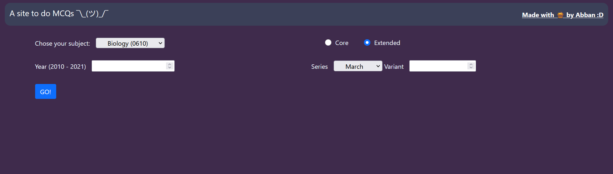
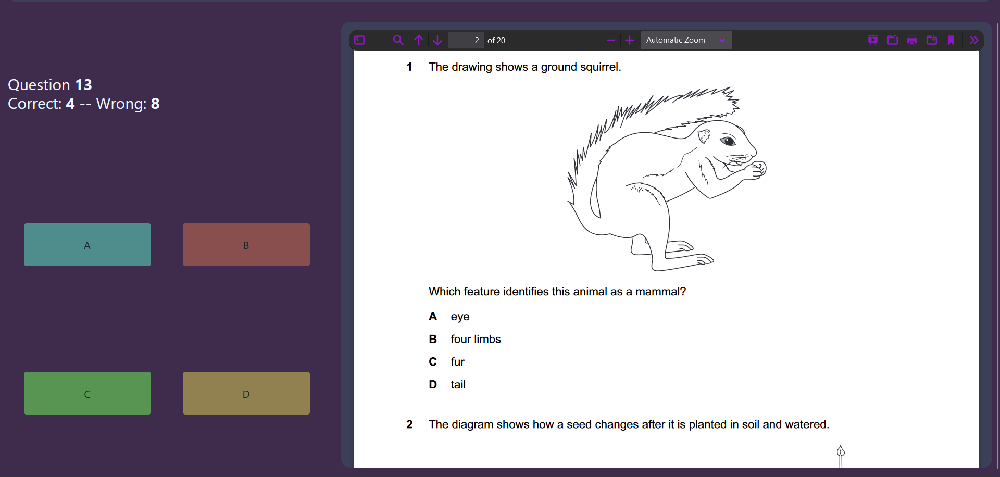

### A little app to help you prepare for the IGCSE Science MCQs

The current subjects available are:

- Biology 0610
- Chemistry 0620
- Physics 0625

No account needed, just select a paper and start answering :)

Link: https://kzdtp9.deta.dev/

> # [IMPORTANT NOTE] The nodejs backend has been deprecated ever since deploying to deta (Heroku has ended their free tier hosting). The npm-related files still remain for those still interested. The new backend runs using python (Flask).

---

### How to host yourself

1. Download the source code, _duh_
2. Get sum python
3. set up a python virtual environment (optional, but recommended for ur sanity)
4. Install all python dependencies using lé `pip`
5. Run `npm install` to install dependencies (deprecated)
6. Run `npm start` to start the node server (deprecated)
7. Run `flask --app main --debug run` to start the flask **development server**

---

### Tasks for the (near) future

- [x] Deploy to Heroku (using something called multi-buildpacks)
- [x] Add a timer
- [x] Show the statistics of the MCQ (time taken, marks)
- [ ] Save each results to `localstorage` for measuring progress over time
- [ ] Do something fun w/ ur life (highly unlikely)
